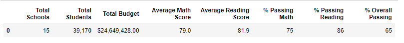
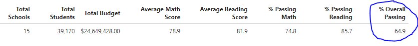
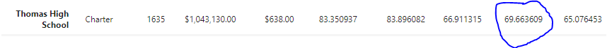
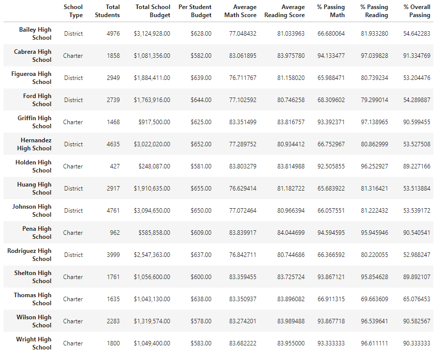
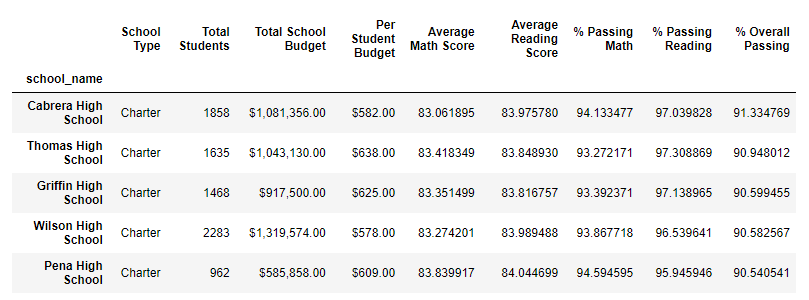
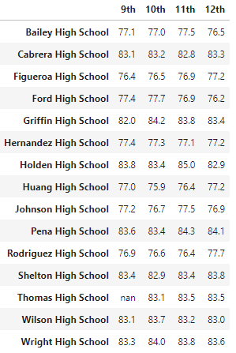
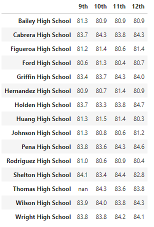

# School_District_Analysis

# Overview of the school district analysis
- The purpose of this analysis is to assist the school district with analyzing standardized test data for reading and math for all the High Schools in the district. In addition to the test scores we will compare the results with the student funding for each school. By performing this analysis we will be able to provide the school distict with the information needed for decision making inregards to the school budgets and priorities. 

# Results
* How is the district summary affected? By removing the ninth grade reading and math tests we removed a total of 461 students from the district summary. In turn if you look at the pictures below you will see that the changes in the average scores and overall passing percentage changed very slightly. The overall passing percentage for the 15 total schools only went up by .1%. 

- Before removing ninth grade

- After removing ninth grade

* How is the school summary affected? In our original analysis Thomas High School had a 91% overall passing percentage for all students prior to the evidence of academic dishonesty. Once the ninth grade test scores were removed we can see in the image below that the percentage dropped drastically to 69%

* Comparing Thomas High School after replacing the ninth graders math and reading scores to other scores in the distrcit. They did drop their perfomance by a lot but it has left them right in the middle of the other schools. They did not fall into the bottom five schools in the district but that also are not in the top five schools. 

* How did replacing ninth-grade scores affect Math and Reading Scores by grade? When doing our original analysis the 9th grade test scores for reading was 83.7 and math was 83.7. By removing these test scores we replaced them  "Nan" as shown below. This shows that there is a missing number in our dataset. 

* How did replacing ninth-grade scores affect scores by school spending? The scores by school spending was not affected by removing the test scores for 9th grade Thomas High School. The school remained in the $630-$644 spending ranges per student. 

* How did replacing ninth-grade scores affect scores by school size? In our original analysis Thomas High School was defined as a Medium school with a range of 1000 to 2000 students. After removing their test scores the school size saw no changes. 

* How did replacing ninth-grade scores affect scores by school type? Thomas High School being a charter school had very minimal impact to the school type percentages.

# Summary
* Due evidence of acadmeic dishonesty we changed the ninth grade test scores for both reading in math to be replaced with Nan. One of the key differences in the updated school distric analysis after making the changes to the ninth grade test scores for Thomas High School is that their overall passing rate dropped from 91% to 69%. This drop in overall percentage caused them to drop from 2nd place in our orignial analysis down to 8th. In terms of affect for school size and type comparing to other schools analyized we did not see any drastic changes. After updating our analysis with the changes made this will allow for the school district to reconsider the budget and how it will affect Thomas High School. 

